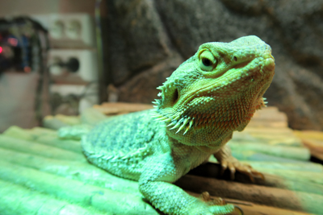

# HabitatControl

## Hvorfor

Skal bygge nytt terrarie til en skjeggagam, et dyr som har litt krevende behov for temperatur og lys; ene enden av terrariet skal holde ca 25 grader, mens andre enden skal være rundt 35, og en solingsplass som kan ha rundt 40-45 grader. Alle temperaturene kan synke ned mot 20-25 om natten, og lys skal være på ca 12 timer i døgnet. I tillegg skal luftfuktighet ligge på et visst nivå.

For å oppnå varmen, trenger man varmekilder, og disse trenger styring i form av termostater. De som er vanlige i hobbyen kan kun styre en varmekilde, så for full kontroll ville jeg trengt minst to, kanskje tre. Da ville jeg hatt to-tre skjermer, og fremdeles ikke kontroll på luftfuktighet, så jeg bestemte meg for å se om jeg kunne lage et komplett system som kunne ta seg av alt.

## Hvordan
Jeg startet med å sette opp en kravspesifikasjon:
* må kunne styre lys, to-tre  varmekilder og evt regnsystem.
* vil ha mulighet til å se full status på en skjerm.
* vil ha mulighet til å styre temperaturen på tid, slik at agamen får naturlige temperatursvingninger iløpet av dagen.
* Må passe på kretskort som er 100x100mm eller mindre (for å få pris på kort+frakt under momsgrensa)
* Styres av arduino nano, som jeg har mange av liggende

Jeg har erfaring med en programmerbar touchskjerm fra før, så jeg visste at jeg ville bruke den. Jeg fant ganske raskt presise temp/luftfuktighet sensorer (dht22), og oppdaget et det fantes uv-sensorer som var ganske billige, så la til det. For å styre sterkstrømmen ville jeg prøve å bruke noen releer som skal tåle 10a 250vac.

Jeg tegnet kretsen i autodesk eagle, og fikk laget kretskort i Kina via dirtypcbs.com
Tegnet fester for kretskortet i Fusion 360, og printa dette på 3d-printeren min.

For å kunne koble til sensorer bruker jeg noen runde skrukoblinger med fire ledere jeg bruker til andre prosjekter. Jeg designet en brakett som jeg kan dytte disse inn i sånn at de låser seg fast, slik at jeg får et slags panel med kontakter.

Hver av disse kontaktene har 5v, jord, en digital pin og en analog pin. Jeg bruker den digitale pinnen for å lese verdier fra DHT22-sensoren, og den analoge for å lese UV-verdien.

I tillegg til tre sensorporter har jeg en port av samme type som går til displayet. Displayet har egen mikrokontroller (som faktisk er kraftigere enn arduinoen som styrer alt), og håndterer alt av knappetrykk osv selv. Når man navigerer sendes kommandoer til arduinoen via seriellkommunikasjon, og arduinoen sender data tilbake. Når man er på oversikt-skjermen sender arduinoen oppdatering av alle verdiene ca en gang i sekundet.

## Erfaringer

* Jeg innså at jeg ønsket logging av verdier, men jeg har ikke beregnet plass til dette på kretskortet, og pinnene som brukes til SD-kort lesere er tatt opp av andre ting. Har midlertidig fix med at jeg lagrer verdier pr time i EEPROM, slik at jeg kan se siste døgns verdier.
* Releene blir lunkne, noe som gjør at jeg blir litt bekymret for om de tåler den belastningen de skal tåle. Har merket at de ikke blir like varme lengre, men fremdeles noe som jeg vil endre på.
* Har tenkt å bruke 12vdc for regnsystem, noe som gjør at jeg må "blande" 230vac og 12vdc. Dette er jeg ikke noe fan av, da det betyr at noen terminaler er "trygge" å ta på, mens andre er livsfarlige.

## Fremover

* Oppgradere til Arduino Mega (Naked Mega)
* Har bestilt halvleder-releer (SSR) som skal tåle 1000W
* Legge til sd-kort leser slik at jeg kan logge verdier oftere, og få gjevnere grafer ut på skjermen
* Har lyst til å kunne styre andre ting som vifter og led-lys, noe som igjen krever flere digitale pins. Derav behovet for å gå over til arduino mega.
* Vurderer å skaffe en større skjerm, da det er vanskelig å treffe ting med fingrene på den lille skjermen jeg bruker nå.

## Resultat

